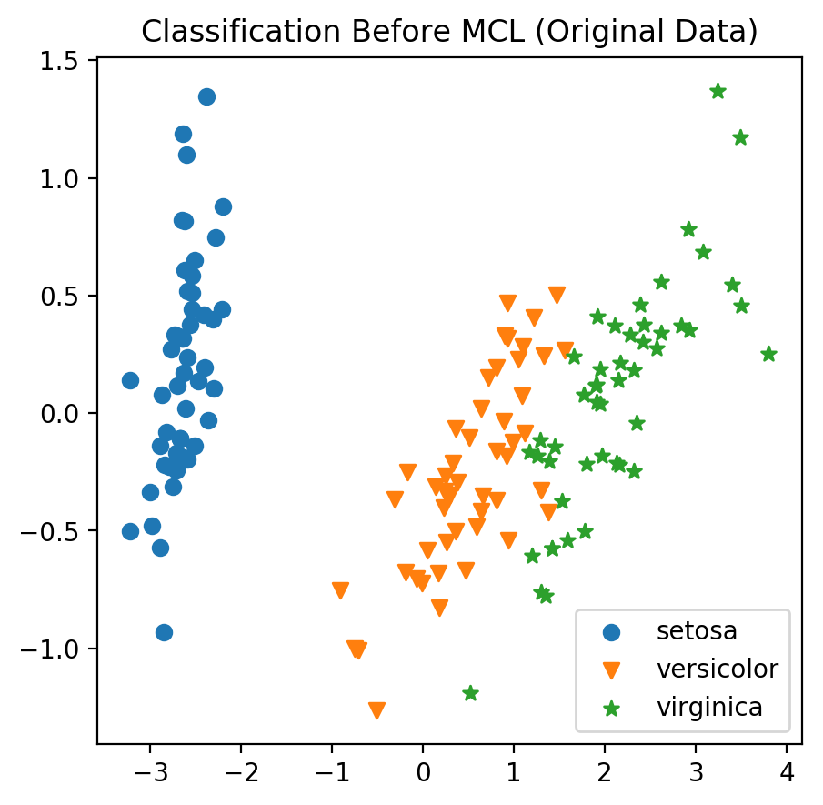
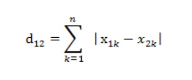

# Clustering Schoolwork——使用马尔可夫聚类算法（MCL）对Iris数据集进行聚类

### 河北师范大学软件学院  2016级 机器学习方向  徐安  2016011434
#### Nov 20 2018

## 一、项目基本思路

1. 使用欧式距离度量计算每个样本之间的相似度，求出矩阵（概率矩阵）

2. 确定阈值，剔除距离过大的值（去掉权值过小的边）

3. 将过大的值后将矩阵转化为无向图

4. 标准化（normalize）矩阵，并进行迭代（乘方（Expansion），膨胀（Inflation））

5. 迭代若干次后，当矩阵趋于稳定时，将结果转化为聚簇

## 二、项目具体实现过程

### (一)  导入iris数据集

在导入数据集时，使用sklearn自带的iris数据集作为原始数据集进行导入。

```python
from sklearn.datasets import load_iris # 从sklearn导入必要的数据集

iris = load_iris()  # 加载数据集
features = iris.data # 获取属性数据(各种特征值)
labels = iris.target # 获取类别数据（花的分类）
target_names = iris.target_names # 获取数据的分类名称（花的分类名称）
```
### (二)  原始数据集可视化

导入数据以后，需要对其进行可视化。由于数据集是四个维度，无法直接可视化，所以使用主成分分析（Principal components analysis，PCA）的方式对原始数据集从四维空间降低到两个维度，以便进行可视化。

```python
# 导入算法包
from sklearn.decomposition import PCA

# 使用PCA降维并进行可视化
pca = PCA(n_components=2)
pca.fit(features)
features_new = pca.transform(features)
```
使用matplotlib绘制样本的散点图：
```python
features_new_1 = plt.scatter(features_new[0:50, 0], features_new[0:50, 1],marker='o')
features_new_2 = plt.scatter(features_new[51:100, 0], features_new[51:100, 1],marker='v')
features_new_3 = plt.scatter(features_new[101:149, 0], features_new[101:149, 1],marker='*')
plt.legend(handles=[features_new_1, features_new_2,features_new_3], labels=['setosa', 'versicolor', 'virginica'],  loc='best')
plt.title('Classification Before MCL (Original Data)')
plt.plot()
```


进行PCA降维后将原始四维空间数据映射到二维空间后的图像如图所示：



###(三) 相似度矩阵的求取

通过求得每个样本之间的距离以求得相似度，并以相似度为度量指标来求得概率转移矩阵。即：当两点距离较近时，其相似度越高，则其在**随机游走（Random Walk）**时概率越大。

对于两点在高维空间的度量，可以采取如下方式：

1. **欧氏距离(Euclidean Distance)**

   两个n维向量a(x11,x12,…,x1n)与 b(x21,x22,…,x2n)间的欧氏距离：


2. **曼哈顿距离(Manhattan Distance)**

   标明两个点上在标准坐标系上的绝对轴距之总和：

   

3. **马氏距离(Mahalanobis Distance)**

   有M个样本向量X1~Xm，协方差矩阵记为S，均值记为向量μ，则其中样本向量X到u的马氏距离表示为：

   

   我们选用**曼哈顿距离(Manhattan Distance)**作为相似度度量的方式：

   ```python
   # 求相似度矩阵
   simple_size = 150 # simple_size定义样本的数量
   sim_arr = [] # sim_arr定义相似度列表
   for i in features:
       for j in features:
           distance = np.abs(i[0]-j[0])+np.abs(i[1]-j[1])+np.abs(i[2]-j[2])+np.abs(i[3]-j[3])  # 求出每个样本点之间的曼哈顿距离
           sim_arr.append(float(distance))  # 将欧式距离转化为float类型,并添加到list中
   sim_arr = np.array(sim_arr) # 将list转化为np.array类型
   sim_arr = sim_arr.reshape(simple_size,simple_size) # 将相似度列表转化为150*150的矩阵形式
   ```

### (四) 相似度处理

在得到相似度矩阵后，在图中表示相似度矩阵时，其每个顶点都是互相连通的。我们需要通过限定阈值的方式去除那些距离较远的、相关度低的边，以达到切割图的目的。

```python
# 设定阈值，将距离大于阈值的边全部剔除，小于等于阈值且不等于阈值（不加自环）的边设置权重为1（转化为无向图）
threshold = 1.5  # 设定阈值

for i in range(simple_size):
    for j in range(simple_size):
        if sim_arr[i][j] > threshold:
            sim_arr[i][j] = 0
        if sim_arr[i][j] < threshold and sim_arr[i][j] != 0:
            sim_arr[i][j] = 1
```

有些概率矩阵不管进行几次计算，都不会收敛，而且，可能仅在奇数步后到达，在偶数步时，永远不可达。因此，无法进行随机游走。为了解决这个问题，我们需要为其添加自环来消除奇偶幂次带来的影响：

```python
# 添加自环
for i in range(simple_size):
    sim_arr[i][i] = 1
```

###  (五) MCL实现的相关函数

在进行马尔科夫聚类时，其算法如下：

1. 输入一个非全连通图，和膨胀算子（Inflation factor）

2. 建立邻接矩阵（Adjacency matrix）

3. 将近邻矩阵的对角线元素置为1（即向图添加自环）

4. 将邻接矩阵归一化（normalize）

5. 将邻接矩阵进行二次乘方（Expansion）

6. 对邻接矩阵进行膨胀（Inflation）

7. 重复5，6步，直到邻接矩阵收敛

**根据以上算法，定义以下函数以便进行MCL算法：**

**(1)  矩阵归一化（normalize）**：将矩阵的样本的值限制在（0，1）之间

```python
# 矩阵归一化
def normalize(matrix):
#     功能：将给定矩阵的行进行归一化
#     输入参数：
#         martix:给定矩阵
#     输出：
#         归一化后的矩阵martix'

    return sklearn.preprocessing.normalize(matrix,norm="l1", axis=0)
```

**（2）矩阵相乘操作（Expansion）：**将矩阵进行二次方

```python
# 矩阵相乘操作(Expansion)
def dot_multiply(matrix):
#     功能：将给定矩阵进行乘法
#     输入参数：
#         martix:给定矩阵
#     输出：
#         相乘后的矩阵martix'
    return np.dot(matrix,matrix)
```

**（3）矩阵膨胀操作（Inflation）**：将矩阵中的每一个元素都求r次幂，之后进行归一化，其中r称为膨胀算子。

```python
# 矩阵膨胀操作（Inflation）
def inflation(matrix,inflat_factor):
#    功能：将给定矩阵进行膨胀操作(先对矩阵做inflat_factor次乘方，之后标准化矩阵)
#    输入参数：
#         martix:给定矩阵
#         inflat_factor:膨胀算子，将矩阵的每一个元素进行inflat_factor次乘方
#      输出：
#          膨胀后的矩阵martix'
    matrix_inflation = np.power(matrix,inflat_factor) # 将矩阵每个元素进行inflat_factor乘方
    matrix_inflation = normalize(matrix_inflation)  # 将乘方好的矩阵进行标准化处理
    
    return matrix_inflation
```

**（4）矩阵收敛的判断：**当进行相乘和膨胀操作后两个矩阵的相似度达到宽容度以下时，即可判定矩阵已经收敛，可以停止迭代

```python
# 判断矩阵是否收敛
def matrix_converge(matrix1,matrix2,rtol=1e-05, atol=1e-08):
#    功能：判断矩阵是否收敛
#    输入参数：
#         matrix1:给定矩阵1
#         matrix2:给定矩阵2
#         rtol=1e-05, atol=1e-08：宽容度
#      输出：
#         bool类型，如果收敛，返回true，否则返回false
#          
    return np.allclose(matrix1,matrix2,rtol=rtol, atol=atol)
```

### （六）邻接矩阵的迭代

对已经按照阈值进行切割的相似度矩阵按照MCL算法进行迭代，直至其收敛。最终收敛的矩阵即为所求的聚类的图。

```python
# 计算带权邻接矩阵
iterate_num = 100 # 指定迭代次数
inflat_factors = 1.8 # 指定膨胀系数

sim_arr_last = sim_arr  # sim_arr_last表示上一次迭代时的矩阵

sim_arr = normalize(sim_arr) # 将矩阵标准化处理

for i in range(iterate_num): # 进行iterate_num次迭代
    sim_arr = dot_multiply(sim_arr)  # 进行矩阵相乘操作
    sim_arr = inflation(sim_arr,inflat_factor=inflat_factors)  # 进行膨胀操作
    if matrix_converge(sim_arr,sim_arr_last):  # 当迭代到相似度基本一致时（基本收敛），提前停止迭代过程
        print('The iteration processed for '+str(i+1)+' rounds')
        print('Iteration has stopped. The best iteration time is '+str(i+1)+".")
        break
    else:
        sim_arr_last = sim_arr
        print('The iteration processed for '+str(i+1)+' rounds')
print('The Adjacency matrix has been converged.')
```

### （七）将邻接矩阵转化为聚类

```python
# 将邻接矩阵转化为聚类  best distance = 1.3 inflat_factors = 3  len(cluster_result) = 3   acc = 0.76
def get_clusters(matrix):

    if not isspmatrix(matrix):
        # cast to sparse so that we don't need to handle different 
        # matrix types
        matrix = csc_matrix(matrix)

    # get the attractors - non-zero elements of the matrix diagonal
    attractors = matrix.diagonal().nonzero()[0]

    # somewhere to put the clusters
    clusters = set()

    # the nodes in the same row as each attractor form a cluster
    for attractor in attractors:
        cluster = tuple(matrix.getrow(attractor).nonzero()[1].tolist())
        clusters.add(cluster)

    return sorted(list(clusters))
```

将邻接矩阵转化为聚类簇之后，将聚类进行输出：

```python
# 输出聚类结果
cluster_result = get_clusters(sim_arr)
len(cluster_result)
for index,i in enumerate(cluster_result):
    print('Cluster '+str(index+1)+':')
    print(i)
    print('The num in cluster is '+str(len(i)))
```

### (八) 聚类结果可视化

将数据集进行MCL处理后，将聚类簇使用主成分分析（Principal components analysis，PCA）进行降维，并输出至低维空间。

```python
# 初始化聚类数据坐标列表
cluster_data_0 = np.zeros(shape=(len(cluster_index_0),2))
cluster_data_1 = np.zeros(shape=(len(cluster_index_1),2))
cluster_data_2 = np.zeros(shape=(len(cluster_index_2),2))
cluster_data_3 = np.zeros(shape=(len(cluster_index_3),2))
# 将聚类结果的坐标添加到列表中
for index,i in enumerate(cluster_index_0):
    cluster_data_0[index] = features_new[i]
for index,i in enumerate(cluster_index_1):
    cluster_data_1[index] = features_new[i]
for index,i in enumerate(cluster_index_2):
    cluster_data_2[index] = features_new[i]
for index,i in enumerate(cluster_index_3):
    cluster_data_3[index] = features_new[i]
# 绘制图像
# plt.figure(figsize=[5,5],dpi=200)
features_new_1 = plt.scatter(cluster_data_0[:, 0], cluster_data_0[:, 1],marker='o')
features_new_2 = plt.scatter(cluster_data_1[:, 0], cluster_data_1[:, 1],marker='v')
features_new_3 = plt.scatter(cluster_data_2[:, 0], cluster_data_2[:, 1],marker='*')
features_new_4 = plt.scatter(cluster_data_3[:, 0], cluster_data_3[:, 1],marker='D')
plt.legend(handles=[features_new_1, features_new_2,features_new_3,features_new_4], labels=['setosa', 'versicolor', 'virginica','other'], loc='best')
plt.title('Classification After MCL (Clustering Result)')
plt.plot()
```

进行降维后使用MCL进行聚类的结果如图所示：

.png)

### (九) 聚类结果评估

由于训练数据集带有标签，所以可以对聚类的准确度进行评估。本项目使用准确度（accuracy）对聚类结果进行评估：

```python
# 导入评估模块
from sklearn.metrics import accuracy_score 

# 使用准确度进行聚类结果的评估
acc = accuracy_score(labels,cluster_lable) 
print('The MCL accuracy is '+str(acc))
```


## 三、参数优化

### （一）影响聚类结果的参数

在使用MCL时，有以下两个关键参数直接影响聚类结果：

#### （1）切割图时丢弃边的阈值（threshold）

由于需要将全连通图转化为非全连通图，将距离远、相关性较弱的边丢弃，一旦边被丢弃则意味着两个节点无直接关系（有边相连），所以在确定阈值时需要选定合适的值以保证处于同一类的样本连通（有边相连），而不是一类的样本不连通（无边相连）

#### （2）膨胀算子（inflation factor）

膨胀算子是对每个样本进行乘方，以使得相似的样本值更加相似，而不同的样本的区别拉大。膨胀算子的取值会影响矩阵的收敛性和分簇的粒度。膨胀算子越大，得到的簇会越大，因为其会放大边之间的差距。

###（二）调参策略

使用**格点搜索法（grid search）**对参数进行选择，以达到最佳的聚类效果。

判断聚类是否最佳的判断标准：簇数目合适，且准确度较高。


## 四、算法性能分析

在本项目中，经过gird search寻优后，使用的关键参数如下：

1. **距离度量方式**：曼哈顿距离（Manhattan Distance）
2. **切割图时丢弃边的阈值（threshold）**：1.5
3. **膨胀算子（inflation factor）**：1.8

最终使用**准确度（accuracy）**对聚类结果进行评价，最中得到的准确度为：

```
accuracy = 0.84
```

经分析，有以下几点因素影响了聚类的准确度：

1. `versicolor`与`virginica `特征较为相似。在样本集进行PCA降维后，可以发现两类别的特征点有交叉的情况。所以在聚类时，由于两者有特征交叉，不容易将其分开，直接影响了聚类的准确度。
2. MCL不能发现重叠的点。在可视化原始数据集时，会发现有部分样本处于几乎重叠的存在，而MCL由于其特点，对重叠的点不能做到很好的辨识，这也造成了聚类出现一定的错误。
3. MCL不能人为规定聚簇数量。本项目是一个三分类任务，当已知聚簇具体数量时，MCL不能根据已知数量进行聚簇数量的选择，造成了出现部分离群聚簇，这也使得聚类准确度下降。